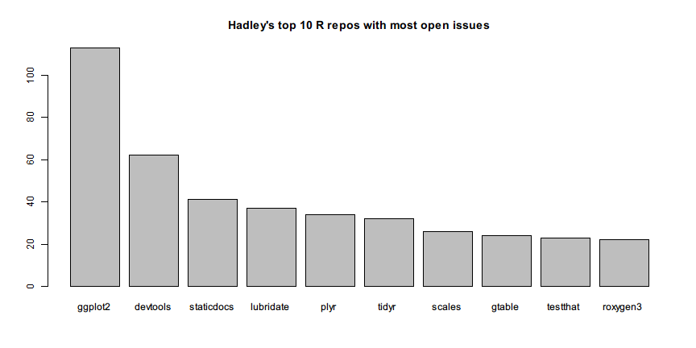

# GitHub API

[GitHub](https://github.com/) is the most famous web-based source code hosting service in the world. Millions of developers choose GitHub to host their public code repositories. Many R packages are hosted by GitHub too.

In addition to the rich features it provides in project development and collaboration, GitHub also opens its [API](https://api.github.com/) for developers to query the meta-data of users and repos. For example, we can directly get the following data:

- [My public profile on GitHub](https://api.github.com/users/renkun-ken)
- [Profile of rlist package](https://api.github.com/repos/renkun-ken/rlist)
- [All my repos on GitHub](https://api.github.com/users/renkun-ken/repos)

If you visit the links in your web browser, you will see the data presented in JSON format.

To make the data exploration more interesting, in the following examples we will explore [Hadley Wickham](https://github.com/hadley)'s GitHub data with functions provided in rlist and see how rlist makes it easier to work with such non-tabular data structures.

We load rlist and pipeR packages first and then retrieve the repos.


```r
library(rlist)
library(pipeR)
repos <- "https://api.github.com/users/hadley/repos?per_page=100&page=%d" %>>%
  sprintf(1:2) %>>%
  list.load("json") %>>%
  list.ungroup
```

Since GitHub API limits the amount of data an ordinary user can retrieve at a time, we use `page=%d` to specify the page of data and we take the first several pages that are non-empty. Finally we turn the list of pages to a list of repos by `list.ungroup()`.

Before walking into details, we review some figures and statistics first. First, the number of repos:


```r
list.count(repos)
```

```
# [1] 150
```

Then the structure of repos in terms of forks and non-forks:


```r
repos %>>%
  list.table(fork)
```

```
# fork
# FALSE  TRUE 
#   114    36
```

GitHub shows the language structure of each individual repo. Here we summarize the language structure of Hadley's all projects.


```r
repos %>>% 
  list.filter(!is.null(language)) %>>%
  list.table(language) %>>%
  list.sort(-.)
```

```
# language
#          R        C++ JavaScript          C        TeX       Ruby 
#         95          9          8          6          5          3 
#      Shell       HTML     Python      Rebol        CSS     Turing 
#          3          2          2          2          1          1
```

or show the table of language by fork:


```r
repos %>>%
  list.table(language, fork)
```

```
#             fork
# language     FALSE TRUE
#   C              3    3
#   C++            7    2
#   CSS            0    1
#   HTML           1    1
#   JavaScript     5    3
#   Python         0    2
#   R             79   16
#   Rebol          2    0
#   Ruby           2    1
#   Shell          1    2
#   TeX            5    0
#   Turing         0    1
#   <NA>           9    4
```

Hadley has created several top-ranked popular packages. Let's build a bar chart to show the top 10 R repos with most stargazers.


```r
repos %>>%
  list.filter(!fork, language == "R") %>>%
  list.names(name) %>>%
  list.mapv(stargazers_count) %>>%
  list.sort(-.) %>>%
  list.take(10) %>>%
  print %>>%
  barplot(main = "Hadley's top 10 R repos with most stargazers")
```

```
#   ggplot2  devtools      plyr     rvest      httr  testthat     tidyr 
#      1223       976       368       308       285       204       167 
# lubridate   reshape     purrr 
#       148       108        94
```


The pipeline itself is clear enough to show what happens in each step. We first filter the repos and pick out the non-fork R repos. Then we give names to the repo elements by their name field. Next we map each element to the count of stargazers, sort them in descending order, and take the top 10 elements. Finally, we build a bar chart from the named integer vector we created.

Hadley is famous for his great contribution of [ggplot2](http://ggplot2.org/) so there should not be surprise as the bar chart shows that the package with most stargazers is ggplot2. 

Using exactly the same method, we can see the the repos with most open issues.


```r
repos %>>%
  list.filter(has_issues, !fork, language == "R") %>>%
  list.names(name) %>>%
  list.mapv(open_issues) %>>%
  list.sort(-.) %>>%
  list.take(10) %>>%
  print %>>%
  barplot(main = "Hadley's top 10 R repos with most open issues")
```

```
#    ggplot2   devtools staticdocs  lubridate       plyr      tidyr 
#        113         62         41         37         34         32 
#     scales     gtable   testthat   roxygen3 
#         26         24         23         22
```



This time you should be able to figure out what is done in each step.

In addition to ggplot2, Hadley's has some other visualization-related repos too. To find out, we can filter the repo names and description by *plot* and *vis* with regular expression.


```r
repos %>>%
  list.filter(any(grepl("plot|vis", c(name, description)))) %>>%
  list.sort(-stargazers_count) %>>%
  list.mapv(name)
```

```
#  [1] "ggplot2"         "bigvis"          "r2d3"           
#  [4] "ggplot2-book"    "gg2v"            "productplots"   
#  [7] "boxplots-paper"  "clusterfly"      "lvplot"         
# [10] "bigvis-infovis"  "densityvis"      "ggplot2-bayarea"
# [13] "layers"          "r-travis"        "toc-vis"        
# [16] "lvplot-paper"    "prodplotpaper"   "rblocks"        
# [19] "rminds"          "spatialVis"      "classifly"      
# [22] "fortify"         "ggplot"          "ggplot2-docs"   
# [25] "vis-migration"   "ggmap"           "imvisoned"      
# [28] "syuzhet"         "vega"
```

The quality of data filtering depends on your conditions. Not every repo shown above is related to data visualization. For example, *r-travis* has nothing to do with visualization although it contains *vis*. To do better data analysis, we would have to think hard about the data. rlist functions attempt to release the big burden from our shoulders so that we won't be easily stuck by such data processing problems.

To compute the sums of the stargazers, watchers and forks of all repos, we can first select the fiedls, stack them, and sum by column.


```r
repos %>>%
  list.select(stargazers_count, watchers_count, forks_count) %>>%
  list.stack %>>%
  colSums
```

```
# stargazers_count   watchers_count      forks_count 
#             7402             7402             3375
```

We can also use fuzzy matching devices when we are not exactly sure about the term we need to find. For example, if you hear from a friend that Hadley's *dplayer* package is awesome but you cannot find the package by its name. To find out the exact name of the that package we can use soundex measurement in stringdist package.


```r
repos %>>%
  list.filter(stringdist::stringdist("dplayer", name, method = "soundex") == 0) %>>%
  list.mapv(name)
```

```
# [1] "dplyr"         "dplyrimpaladb"
```

Cheers! Now we know the package that sounds like *dplayer* is actually named *dplyr*.
