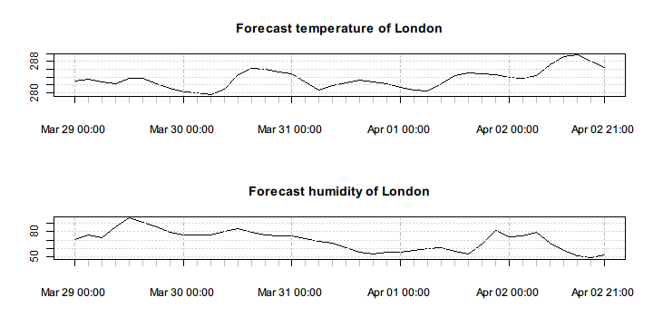

# Weather API

[OpenWeatherMap](http://openweathermap.org/) provides a set of [weather API](http://openweathermap.org/api) that is simple, clear and free. Using the API, we get access to not only the current weather data, forecasts, historical data, and so on. The returned data is by default presented in JSON format, which can be easily loaded and processed by rlist functions.

## Current weather data

The following code downloads the latest weather data of New York and London.


```r
library(rlist)
library(pipeR)
weather <- "http://api.openweathermap.org/data/2.5/weather?q=%s" %>>%
  sprintf(c("New York,us", "London,uk")) %>>%
  list.load("json") %>>%
  list.names(name)
```

`list.load()` in the latest development version of rlist supports loading multiple files given by a character vector. Here we use `sprintf()` to construct a character vector provided the URL template of a weather data query.


```r
str(weather)
```

```
# List of 2
#  $ New York:List of 12
#   ..$ coord  :List of 2
#   .. ..$ lon: num -75.5
#   .. ..$ lat: int 43
#   ..$ sys    :List of 6
#   .. ..$ type   : int 3
#   .. ..$ id     : int 54023
#   .. ..$ message: num 0.361
#   .. ..$ country: chr "US"
#   .. ..$ sunrise: int 1427626102
#   .. ..$ sunset : int 1427671495
#   ..$ weather:List of 1
#   .. ..$ :List of 4
#   .. .. ..$ id         : int 800
#   .. .. ..$ main       : chr "Clear"
#   .. .. ..$ description: chr "sky is clear"
#   .. .. ..$ icon       : chr "02n"
#   ..$ base   : chr "stations"
#   ..$ main   :List of 5
#   .. ..$ temp    : num 266
#   .. ..$ pressure: int 1022
#   .. ..$ temp_min: num 264
#   .. ..$ temp_max: num 266
#   .. ..$ humidity: int 46
#   ..$ wind   :List of 3
#   .. ..$ speed: num 3.08
#   .. ..$ gust : num 4.11
#   .. ..$ deg  : int 293
#   ..$ snow   :List of 1
#   .. ..$ 3h: int 0
#   ..$ clouds :List of 1
#   .. ..$ all: int 8
#   ..$ dt     : int 1427590591
#   ..$ id     : int 5128638
#   ..$ name   : chr "New York"
#   ..$ cod    : int 200
#  $ London  :List of 12
#   ..$ coord  :List of 2
#   .. ..$ lon: num -0.13
#   .. ..$ lat: num 51.5
#   ..$ sys    :List of 6
#   .. ..$ type   : int 3
#   .. ..$ id     : int 40047
#   .. ..$ message: num 0.556
#   .. ..$ country: chr "GB"
#   .. ..$ sunrise: int 1427607706
#   .. ..$ sunset : int 1427653719
#   ..$ weather:List of 1
#   .. ..$ :List of 4
#   .. .. ..$ id         : int 802
#   .. .. ..$ main       : chr "Clouds"
#   .. .. ..$ description: chr "scattered clouds"
#   .. .. ..$ icon       : chr "03n"
#   ..$ base   : chr "stations"
#   ..$ main   :List of 5
#   .. ..$ temp    : num 283
#   .. ..$ humidity: int 68
#   .. ..$ pressure: num 1006
#   .. ..$ temp_min: num 282
#   .. ..$ temp_max: num 284
#   ..$ wind   :List of 3
#   .. ..$ speed: num 3.7
#   .. ..$ gust : num 6.5
#   .. ..$ deg  : int 181
#   ..$ rain   :List of 1
#   .. ..$ 3h: int 0
#   ..$ clouds :List of 1
#   .. ..$ all: int 48
#   ..$ dt     : int 1427590573
#   ..$ id     : int 2643743
#   ..$ name   : chr "London"
#   ..$ cod    : int 200
```

We can see that `weather` includes the the information of the city as well as the weather.

The weather API also supports box searching, that is, search data from cities within the defined rectangle specified by the geographic coordinates. `bbox` indicates the bounding box of the following parameters: lat of the top left point, lon of the top left point, lat of the bottom right point, lon of the bottom right point, map zoom.


```r
zone <- "http://api.openweathermap.org/data/2.5/box/city?bbox=%s&cluster=yes" %>>%
  sprintf("12,32,15,37,10") %>>%
  list.load("json")
```

```
# Error in open.connection(con, "rb"): HTTP error 510.
```

Once we get the data, we can see the names of the cities in the zone.


```r
zone$list %>>% 
  list.mapv(name)
```

```
# Error in zone$list %>>% list.mapv(name): object 'zone' not found
```

We can also build a table that shows the weather condition of these cities.


```r
zone$list %>>% 
  list.table(weather[[1L]]$main)
```

```
# Error in zone$list %>>% list.table(weather[[1L]]$main): object 'zone' not found
```

For more details, we can group the data by weather condition and see the name list for each type of weather.


```r
zone$list %>>%
  list.group(weather[[1L]]$main) %>>%
  list.map(. %>>% list.mapv(name))
```

```
# Error in zone$list %>>% list.group(weather[[1L]]$main): object 'zone' not found
```

Sometimes it is easier to work with data frame for vectorization and model research. For example, we can build a data frame from the non-tabular data by *stacking* the list elements with selected fields.


```r
zonedf <- zone$list %>>%
  list.select(id, name, 
    coord_lon = coord$lon, coord_lat = coord$lat, 
    temp = main$temp, weather = weather[[1L]]$main) %>>%
  list.stack %>>%
  print
```

```
# Error in zone$list %>>% list.select(id, name, coord_lon = coord$lon, coord_lat = coord$lat, : object 'zone' not found
```

The data frame well fits the input of most models.


```r
zonedf %>>%
  lm(formula = temp ~ coord_lon + coord_lat) %>>%
  summary
```

```
# Error in zonedf %>>% lm(formula = temp ~ coord_lon + coord_lat): object 'zonedf' not found
```

## Forecast data

The weather API provides give access to the forecast data. Here we get the forecast data of the London city.


```r
forecast <- "http://api.openweathermap.org/data/2.5/forecast?q=London,uk" %>>%
  list.load("json")
```

The forecast incorporates some meta-information such as the city data and message retrieval data. We can easily transform the forecast points to an `xts` object as a time series.


```r
fxts <- forecast$list %>>%
  list.select(dt = as.POSIXct(dt_txt), 
    temp = main$temp, humidity = main$humidity) %>>%
  list.stack %>>%
  (xts::xts(x = .[-1L], order.by = .$dt))
head(fxts)
```

```
#                        temp humidity
# 2015-03-29 00:00:00 283.100       71
# 2015-03-29 03:00:00 283.590       76
# 2015-03-29 06:00:00 282.810       73
# 2015-03-29 09:00:00 282.280       86
# 2015-03-29 12:00:00 283.600       96
# 2015-03-29 15:00:00 283.708       91
```

As long as the data we are interested in is converted to a time series, we can easily create graphics from it.


```r
par(mfrow=c(2,1))
plot(fxts$temp, main = "Forecast temperature of London")
plot(fxts$humidity, main = "Forecast humidity of London")
```



## Historical data

The weather API allows us to access the historical weather database. The database adopts UNIX Date/Time standard for which we define `unixdt()` to better transform human-readable date/time to numbers included in the data query.


```r
unixdt <- function(date) {
  as.integer(as.POSIXct(date, tz = "UTC"))
}
```

The following code queries the hourly historical data of New York from `2014-10-01 00:00:00` and get the maximal number of records a free account is allowed.


```r
history <- "http://api.openweathermap.org/data/2.5/history/city?&q=%s&start=%d&cnt=200" %>>%
  sprintf("New York,us", unixdt("2014-10-01 00:00:00")) %>>%
  list.load("json")
```

Once the historical data is ready, we can get some simple impression on it. For example, we can see the weather distribution.


```r
history$list %>>%
  list.table(weather = weather[[1L]]$main) %>>%
  list.sort(-.)
```

```
# integer(0)
```

We can also inspect the location statistics of humidity data for each weather condition.


```r
history$list %>>%
  list.group(weather[[1L]]$main) %>>%
  list.map(. %>>% 
      list.mapv(main$humidity) %>>% 
      summary)
```

```
# Warning in is.na(x): is.na() applied to non-(list or vector) of type
# 'NULL'
```

```
# list()
```

Or we can create an `xts` object from it.


```r
nyxts <- history$list %>>%
  list.select(dt = as.POSIXct(dt, origin = "1970-01-01"), 
    temp = main$temp, humidity = main$humidity) %>>%
  list.stack %>>%
  (xts::xts(x = .[-1L], order.by = .$dt))
```

```
# Error in xts::xts(x = .[-1L], order.by = .$dt): order.by requires an appropriate time-based object
```

```r
head(nyxts)
```

```
# Error in head(nyxts): object 'nyxts' not found
```

The object facilitates time series operations but also can be used in time series model fitting.


```r
forecast::auto.arima(nyxts$temp)
```

```
# Error in as.ts(x): object 'nyxts' not found
```

